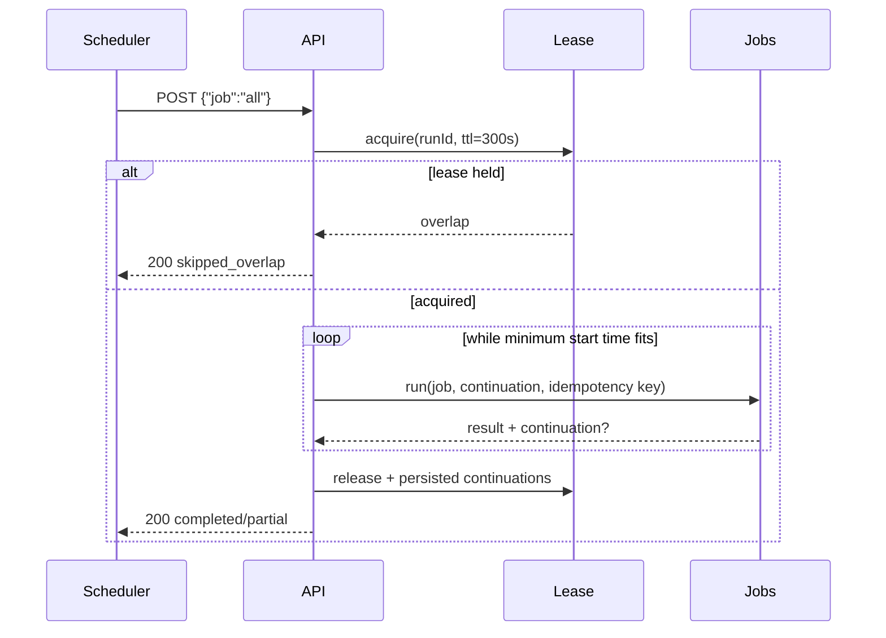

# Workflow automation reliability

Production architecture and operations for `POST /api/automation/run`.

## Architecture

```mermaid
flowchart LR
  CS[Cloud Scheduler hourly] -->|POST + x-sync-secret| API[/api/automation/run]
  API --> AUTH[secret authorization]
  AUTH --> REG[validated job registry]
  REG --> BUDGET[execution budget 240s]
  BUDGET --> LEASE[(automationLeases/scheduler)]
  LEASE -->|acquired| ORCH[bounded orchestrator]
  LEASE -->|held| SKIP[200 skipped_overlap]
  ORCH --> JOBS[priority jobs + batches]
  JOBS --> RUNS[(automationRuns)]
  JOBS --> CURS[versioned continuations]
  CURS --> LEASE
```

## Events

| Workflow event | Triggers |
|----------------|----------|
| `attendance_requested` | Paid request — notify SME + nearby agents (WhatsApp) |
| `request_paid` | PayFast payment confirmed — unlock agents |
| `request_accepted` | Agent/admin assign — notify SME |
| `report_uploaded` | Briefing report — PDF summary + SME/admin WhatsApp |
| `tender_closing_soon` | Tracked tender closing within 24h |
| `briefing_missed` | Agent absent after briefing window |

## Scheduled jobs

`POST /api/automation/run` with header `x-automation-secret` or `x-sync-secret` (production).

Backward-compatible body: `{ "job": "all" }`; a missing body or missing `job`
also means `all`. A named job runs only that job. Unknown names and non-string
continuations return `400`; authorization remains unchanged.

The source of truth is `backend/services/automation/jobRegistry.js`. Each entry
declares priority, minimum safe start time, retry strategy, side-effect risk,
and batch size where applicable. Do not duplicate a hard-coded job list.

Cloud Scheduler example (hourly):

```bash
curl -X POST https://www.tenderbriefing.co.za/api/automation/run \
  -H "x-sync-secret: YOUR_SYNC_SECRET" \
  -H "Content-Type: application/json" \
  -d '{"job":"all"}'
```

## Execution budget

`executionBudget.js` owns all timing. Defaults:

- Cloud Run / Scheduler request timeout: `300000ms`
- execution budget: `240000ms`
- explicit safety margin: `20000ms`
- unused reserve beyond the explicit margin: `40000ms`

Server-only overrides are validated integers:

- `AUTOMATION_REQUEST_TIMEOUT_MS` (30s–3600s)
- `AUTOMATION_SAFETY_MARGIN_MS` (1s to timeout−1s)
- `AUTOMATION_BUDGET_MS` (1s to timeout−margin)

Invalid or unsafe values fail back to defaults. Tests inject a clock; production
uses `Date.now`.

## Lease and overlap behavior

`automationLeases/scheduler` is acquired atomically in a Firestore transaction.
JSON and in-memory adapters use a serialized compatibility implementation.

- held, unexpired lease → HTTP `200`, status `skipped_overlap`
- expired lease → atomic takeover
- owner releases after the run; a different owner cannot release it
- lease TTL equals the request timeout, so killed requests eventually recover
- after a per-job slice timeout, the owner is retained until expiry because
  `Promise.race` cannot cancel arbitrary legacy work; Scheduler retries skip it

Cloud Scheduler retries no longer multiply the same heavy sweep.

## Partial completion and continuation

Jobs run by registry priority from a persisted continuation:

- Anything that will not fit in the remaining budget is **deferred**, and the
  next run starts at the first deferred job, so no job starves.
- A job that outlives its slice is aborted, reported under `timedOutJobs`, and
  the cursor moves past it.
- Response status is `completed`, `partial`, or `skipped_overlap`; all are HTTP
  `200` because each is a successful bounded orchestration decision.
- Continuations are opaque base64url JSON with version `v:1`. Unknown versions
  fail closed to a fresh cursor.
- Daily briefs and watchlists process 5 principals per batch; ingestion runs 2
  sources; calendar processes 200 requests and caps tender events.

A single named job (`{"job":"sla_escalations"}`) bypasses the cursor, the budget,
and the lock.



## Persistence and visibility

- `automationRuns/{runId}`: bounded error summaries, timings, status, completed,
  deferred and timed-out jobs, budget metadata, continuation metadata.
- `automationLeases/scheduler`: current owner, expiry and job continuations.
- JSON adapter: `backend/data/automation-state.json`, capped at 100 run records.
- Memory adapter: deterministic tests.

Firestore rules deny all client access to both collections. Founder-only server
visibility is `GET /api/founder/automation-runs?limit=20`, protected by
`verifyFounderUser`. Existing admin command-centre health remains compatible
and receives only aggregate workflow telemetry.

## Response and telemetry contract

Response metadata includes `runId`, `requestId`, `status`, `continuation`,
`ranAt`, and the bounded result. Headers:

- `x-request-id`
- `x-automation-run-id`
- `x-automation-status`
- `cache-control: no-store`

Structured logs contain event, run ID, status, duration and counts only. They
never include scheduler secrets, request bodies, recipient IDs, phone numbers,
or continuation payloads.

## Scan and complexity controls

Deterministic full-storage call counts for a 5-SME / 5-agent batch:

- daily brief before: tenders `10`, requests `15`; after: `1` / `1`
- watchlists before: tenders `5`, requests `5`; after: `1` / `1`
- tender closing tracked-tender scan before: `C` collection-group reads for `C`
  closing tenders; after: `1` when `C > 0`, otherwise `0`
- calendar storage reads remain `1` tender + `1` attendance read, but request
  processing is batched and sorted sliding-window comparison stops after 24h,
  replacing an unbounded all-pairs comparison with a time-local window.

Daily notification keys remain deterministic per SME/date through the existing
notification idempotency layer. Workflow event keys are deterministic per
event/entity; retries therefore suppress duplicate external side effects.

## Scheduler configuration

Current production job: `tenderbriefing-workflow-automation-hourly`, location
`europe-west1`, schedule `0 * * * *`, timezone `Africa/Johannesburg`, body
`{"job":"all"}`, 300s deadline, 2 retries.

The idempotent script is dry-run by default and never prints the secret:

```bash
npm run scheduler:automation:configure
# Review output, then an authorized operator may run:
npm run scheduler:automation:configure -- --apply
```

It reads `tenderbriefing-sync-secret:latest` from Secret Manager only in apply
mode and creates or updates the job. This release does not execute the script.

## SLA

- **15 min** — unpaid assignment queue: notify additional agents
- **60 min** — escalate to admins via workflow + WhatsApp

## Firestore

Collection `workflowEvents/{id}` — event status, payload, retries, channels.

## Admin

`/admin/operations` — workflow panel, retry failed WhatsApp, telemetry.

APIs:

- `GET /api/admin/workflow-events`
- `GET /api/admin/automation-health`
- `POST /api/admin/notifications/retry`

## QA

```bash
npm test
npm run test:firestore-emulator
npm run workflow:qa
npm run typecheck
npm run lint
npm run build
```

## Push notifications (retired)

Push notifications were **retired** in Batch C (2026-08). Supported channels: **in-app inbox**, **Resend email**, **WhatsApp** (fail-closed when not configured). Legacy routes return **410 Gone** with code `PUSH_NOTIFICATIONS_RETIRED`. See `docs/operations/PUSH_NOTIFICATIONS_RETIRED.md`.
