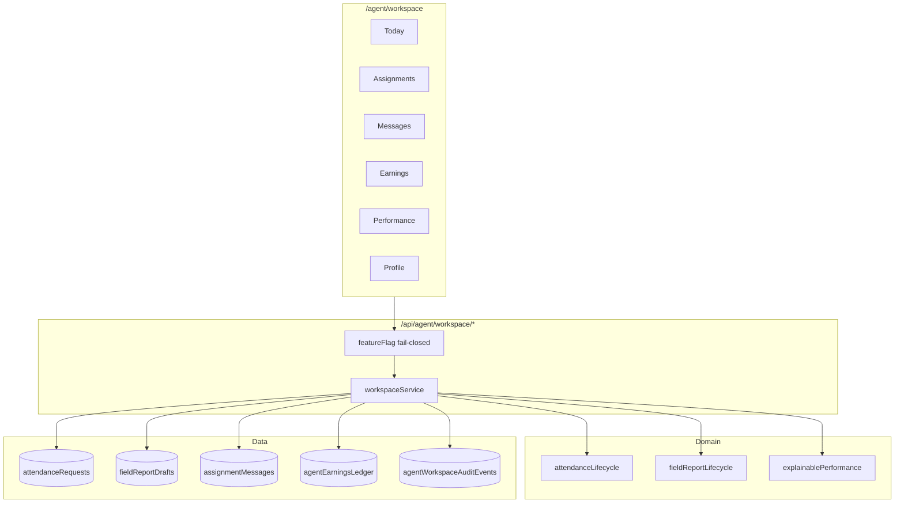
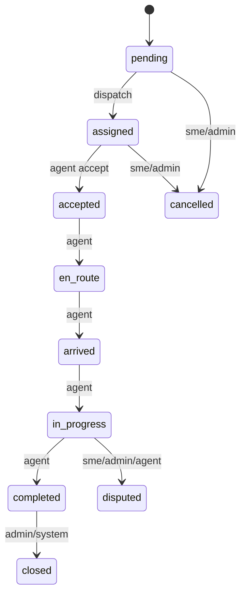
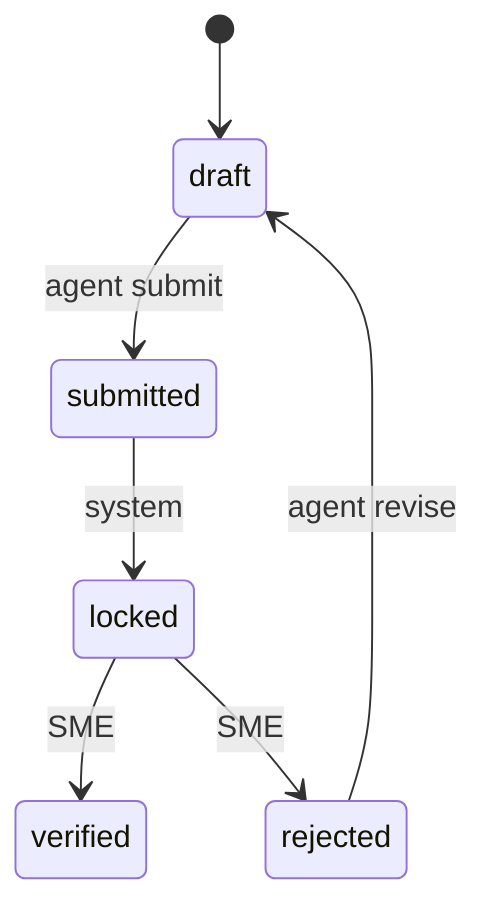

# Youth Agent Workspace — Architecture

## Overview

Professional mobile-first field ops workspace for approved Youth Agents.

## Assignment state machine

Reuses attendance workflow (no duplicate):

## Field report lifecycle

## Security

- Flag `youth_agent_workspace_v1` fail-closed + UID allow-list
- All mutations via Admin SDK APIs after `verifyApiUser`
- Firestore client writes disabled for ledger/audit; drafts/messages ownership-scoped
- Evidence under `briefing-proofs/{requestId}/**` and `workspace-evidence/{requestId}/**`
